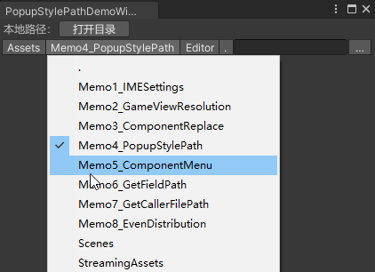
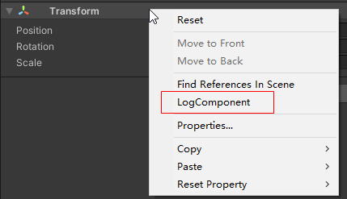
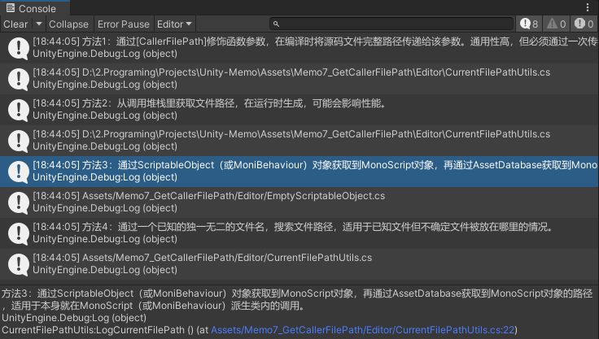
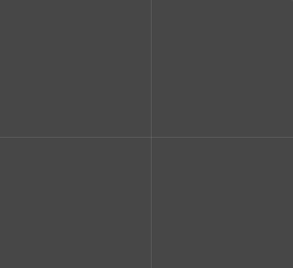
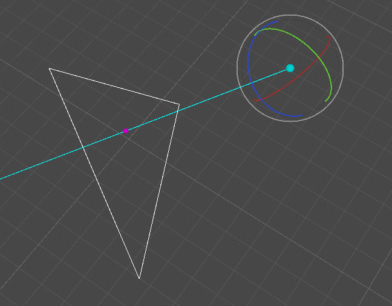
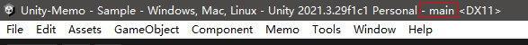
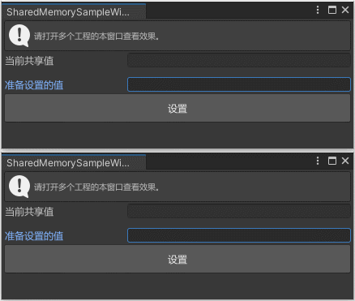
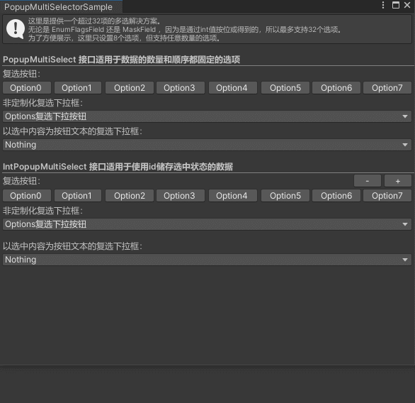
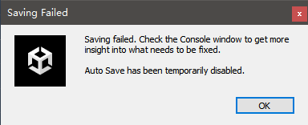
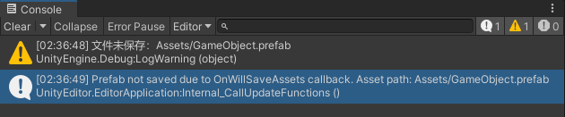

# Unity备忘录
本仓库用来备忘一些Unity相关的技术，包括API、算法、实现效果、某些问题的解决方案等。  
**这些东西有以下一个或几个特征：**  
1.Unity提供的很简单的某组API。  
2.并非我原创，而是从某些途径学习到的技术点（可能会做些许修改）。  
3.是我原创，但用的时候需要根据具体需求做相应修改，而不能形成独立完整的插件。  

## 备忘1：IMESettings
用于控制Unity输入框是否支持输入法。  
我们平时使用Unity编辑器时，偶尔会出现输入框不能输入中文的问题，用它重新设置一下模式就可以解决这个问题。  
**示例：** 在菜单栏中可以找到相应的设置项。  

## 备忘2：GameViewResolution
增删改查Game窗口的分辨率预设列表，并可设置当前应用的是第几个预设。  
同时还展示了如何利用友元程序集去访问官方程序集内的被 **internal** 关键字修饰的成员。  
**示例：** 在菜单栏中可以找到相应的设置项，但示例并不完全，建议直接看代码。

## 备忘3：ComponentReplace
这是个老脚本废弃方案——遍历整个工程，将所有对老脚本的引用定制化替换为新的脚本，即使新老脚本的成员变量完全不同。（需要将资产序列化模式改为文本模式。）  
之前在项目开发过程中，我遇到个问题：曾经写的某个脚本无法满足日益增长的需求，但是如果直接重写这个脚本，又暂时没有时间做回归测试。于是我决定新写一个脚本，新的内容用新的脚本，老内容暂时不去动它，等以后时间足够了，再把老脚本替换成新脚本。  
但由于脚本是挂在GameObject上的，做成prefab后，数据都序列化到文件中了，而新脚本里某些字段的类型都变了，比如从bool变成了int[]，如果仅仅是简单的替换GUID，那么大量的序列化数据将会丢失。  
针对某个Prefab的替换思路（场景文件同理，但由于项目中并没有用到场景资源，所以没有做处理。）：  
1. 找到所有老脚本对象，在其所在的GameObject上挂上新脚本，并赋值好数据。由于Prefab支持嵌套，所以还得处理外部对内部进行的覆盖修改：  
   1. 替换Prefab内不属于子孙Prefab的老脚本。  
   2. 修改对子孙Prefab新增的老脚本。（可以合并到最后一条一起处理）  
   3. 修改对子孙Prefab移除的老脚本。（由于最终FileID没变，所以可以忽略）  
   4. 修改对子孙Prefab中老脚本的修改。  
2. 以文本的形式打开prefab文件，将老脚本与新脚本的FileID交换。  
3. 刷新工程后重新读取prefab，移除所有老脚本对象。  

脚本分为替换逻辑（ReplaceComponents）和变量映射逻辑（Converter_XXX）两部分，前者负责遍历整个工程的Prefab并进行替换操作，后者负责把老脚本的变量映射到新脚本的变量上。  
**示例：** 由于 Converter_Default 是空的，所以菜单栏中对应的菜单项没有任何功能，建议直接看代码。  

## 备忘4：PopupStylePath
一个Windows资源管理器地址栏风格的文本输入框。  
这是从我以前写的一个OSS上传工具中抽出来的，曾经我用它展示本地文件夹路径和远端OSS路径（通过网络请求获取远端目录）。  
  
**示例：** 在菜单栏中可以找到相应的菜单项，点击可打开示例窗口。  

## 备忘5：ComponentMenu
全局地在所有组件右键菜单中添加菜单项。  
  
**示例：** 在Inspector面板中，右键点击任意组件标题，在弹出的菜单中可以看到新增的“LogComponent”菜单项，点击菜单项可以打印组件对象。  

## 备忘6：GetFieldPath
将一连串的成员变量路径转成字符串的形式，类似 **nameof** 关键字。  
有时候为了统一处理，我们需要获取变量路径，但直接手写变量路径容易出错，这个方法就能避免手写路径。  
**示例：** 在菜单栏中可以找到相应的菜单项，点击可打印出"transform.position.magnitude"。
``` C#
FieldPathUtils.GetFieldPath((GameObject go) => go.transform.position.magnitude); // "transform.position.magnitude"
```

## 备忘7：GetCallerFilePath
用四种方法获取当前脚本的路径：  
* 通过 [CallerFilePath] 修饰函数参数，在编译时将源码文件完整路径传递给该参数。通用性高，但必须通过一次传参。  
* 从调用堆栈里获取文件路径，在运行时生成，可能会影响性能。  
* 通过ScriptableObject（或MoniBehaviour）对象获取到MonoScript对象，再通过AssetDatabase获取到MonoScript对象的路径，适用于本身就在MonoScript或MoniBehaviour派生类内的调用。  
* 通过一个已知的独一无二的文件名，搜索文件路径，适用于已知文件但不确定文件被放在哪里的情况。  

  
**示例：** 在菜单栏中可以找到相应的菜单项，点击可打印出脚本的路径。  

## 备忘8：EvenDistribution
在 **圆形平面** 或 **球面** 上均匀分布点，可用于视野内均匀分布射线检测。  
其原理是将多个坐标，以幂函数分配到圆心的距离（为了处理中间密边缘疏的问题），然后从圆心到边缘螺旋分布，每次旋转黄金分割比例（(√5-1)/2）的弧度值。  
 
  
**示例：** 打开 Memo008_EvenDistribution/Scenes 目录下的 [**Sample**](Assets/Memo008_EvenDistribution/Scenes/Sample.unity) 场景，即可在 **Scene窗口** 查看效果。  

## 备忘9：RayIntersectsTriangle
判断射线与三角面是否相交，若相交，则返回距离。  
参考了 [**《如何判断三维空间中射线是否与三角形相交》**](https://zhuanlan.zhihu.com/p/687077146) ，原理文章里有写。
  
**示例：** 打开 Memo009_RayIntersectsTriangle/Scenes 目录下的 [**Sample**](Assets/Memo009_RayIntersectsTriangle/Scenes/Sample.unity) 场景，即可在 **Scene窗口** 查看效果。  

## 备忘10：TitleModifier
修改Unity编辑器主窗口的标题，显示当前Git分支名称。  
  
**示例：** 在菜单栏中可以找到更新标题的设置项。  

## 备忘11：共享内存（IPC）
封装跨进程共享内存的读和写。  
  
**示例：** 在菜单栏中可以找到相应的菜单项，点击可打开示例窗口。  

## 备忘12：对 IMGUI 的一些封装
之前写 **Unity-ControlSystem** 仓库时封装的一些IMGUI接口，因为经常需要打开查阅一下，就干脆放这里来了。  
* CustomEditorGUI.BeginLabelWidth/EndLabelWidth：设置和恢复EditorGUIUtility.labelWidth  
* CustomEditorGUI.BeginFieldWidth/EndFieldWidth：设置和恢复EditorGUIUtility.fieldWidth
* CustomEditorGUI.BeginIconSize/BeginIconSize：设置和恢复默认的Icon尺寸
* CustomEditorGUI.BeginColor/EndColor：设置和恢复GUI.color
* CustomEditorGUI.BeginContentColor/EndContentColor：设置和恢复GUI.contentColor
* CustomEditorGUI.BeginBackgroundColor/EndBackgroundColor：设置和恢复GUI.backgroundColor
* CustomEditorGUI.BeginRotate/EndRotate：设置和恢复GUI坐标系的旋转
* CustomEditorGUI.BeginScale/EndScale：设置和恢复GUI坐标系的缩放
* CustomEditorGUI.BeginDisabled/EndDisabled：设置和恢复GUI.enabled
* CustomEditorGUI.BeginBold/EndBold：设置和恢复默认是否粗体字
* CustomEditorGUI.BeginSceneGUI/EndSceneGUI：在Scene窗口中绘制GUI内容
* CustomEditorGUI.IsVertical：当前布局是否是竖向布局（否则为横向）
* CustomEditorGUI.IsPrefabComparing：当前窗口是否是Prefab对比窗口
* CustomEditorGUI.GetContextWidth：获得当前内容的宽度
* CustomEditorGUI.GetLastRect：获得上一个组件的范围
* CustomEditorGUI.GetNextRect：获得下一个组件的范围
* CustomEditorGUI.Repaint：重绘当前的View
* CustomEditorGUI.RepaintAllInspectors：重绘所有Inspector窗口
* CustomEditorGUI.RepaintEditorWindows：重绘所有窗口
* CustomEditorGUI.RepaintScene：重绘场景（排队重绘）
* CustomEditorGUI.RepaintSceneImmediate：重绘场景（直接调用重绘）
* CustomEditorGUI.RepaintAllViews：重绘所有
* CustomEditorGUI.DisableScenePick：Scene窗口中阻止选中场景中其他对象
* PopupContent：一个通用的下拉窗口，支持设置长宽，支持通过传入回调来绘制窗口内容。  
* PopupMultiSelector：封装的一个支持超过32个选项的多选下拉菜单。  
    
**示例：** 在菜单栏中可以找到相应的菜单项，点击可打开PopupMultiSelector的示例窗口。其他接口请直接看代码。  

## 备忘13：阻止资源文件保存
在保存流程中过滤掉指定资源路径，从而阻止部分资源的保存。可用于资源合法性检查等。  
  
  
**示例：** 在菜单栏中可以找到相应的菜单项，点击可切换开关。  
